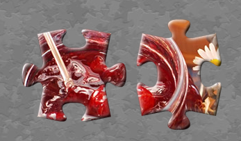
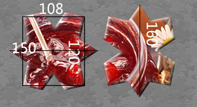
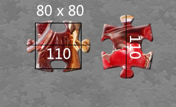

# 个数
* 24 = 4 * 6
* 48 = 6 * 8
* 63 = 7 * 9
* 108 = 9 * 12
* 192 = 12 * 16 
* 300 = 12 * 25
* 520 = 26 * 20
* 768 = 192 * 4 = 24 * 32

# 大小
拼图大小有两部分 
* 外框：决定每片的显示大小
* 内框：决定每片间拼和的大小
    * 108 ~= 640 / 6
    * 120 = 480 / 4
* 
* 
* 
* 

# puzzle-mark.png
* 总大小 1024 * 1024
* 每块  256 * 256
* 内框 128 * 128
* alpha 通道：透明
* green 通道：高光
* blue  通道：阴影

# piece object
* collider =  图像大小 / 200
* scale = 200 / 拼图个数 * （标准大小 / 图像大小）
